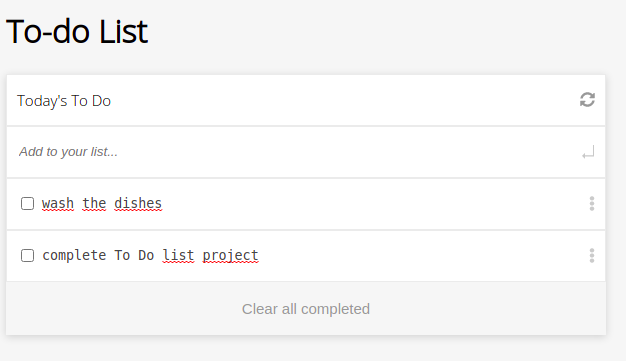

# To-do List

> This project, proposed by Microverse, consists of make a To-Do list application, to dynamically add, move, remove, and store tasks. I used Webpack to manage the different modules. The design was obtained from [this minimalist](https://web.archive.org/web/20180320194056/http://www.getminimalist.com:80/).

## Built With

- HTML
- CSS
- Javascript
- Webpack

## Live Demo

[My portfolio](https://nachosala89.github.io/to-do-list/)

## Getting Started

To get a local copy up and running follow these simple example steps:
- Clone the repo to your computer.
- Run "npm install" to make webpack works.
- Open ./dist/index.html in your browser.

👤 **Nacho Sala**

- GitHub: [@nachosala89](https://github.com/nachosala89)
- Twitter: [@nachosala89](https://twitter.com/nachosala89)
- LinkedIn: [Juan Ignacio Sala](https://www.linkedin.com/in/juan-ignacio-sala)

## 🤝 Contributing

Contributions, issues, and feature requests are welcome!

Feel free to check the [issues page](../../issues/).

## Show your support

Give a ⭐️ if you like this project!

## 📝 License

This project is [MIT](./MIT.md) licensed.